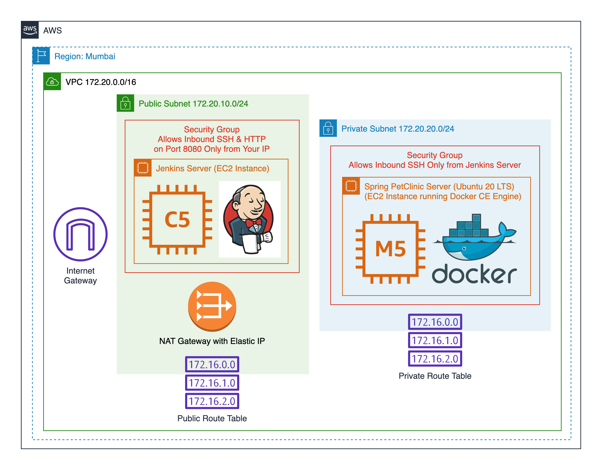

# Spring PetClinic DevOps

Terraform scripts to create AWS infra for hosting &amp; CI/CD of spring-petclinic.

## What is Deployed?

## Terraform Outputs

- `my_ip`: Your system's public IP. It's whitelisted in Jenkins server's security group so you can SSH to it or browse to the Jenkins UI on port 8080.

- `jenkins_ip`: Public IP of the Jenkins server, in case you need to SSH to it.

- `jenkins_url`: Browse to this URL to access Jenkins.

- `spring_petclinic_private_ip`: Private IP of the server hosting the Spring PetClinic app, in case you need to SSH to it (via the Jenkins server of course).

## Steps to Use this Solution

- Clone this repo.
- Run `terraform init && terraform apply` & note the Terraform outputs.
- Run `ssh -i spring-petclinic.pem ubuntu@JENKINS_IP -c 'sudo cat /var/lib/jenkins/secrets/initialAdminPassword'` to get Jenkins password.
- Open `JENKINS_URL` in browser & enter password.
- Configure Jenkins & create a pipeline to deploy Spring PetClinic.
- Once Spring PetClinic is deployed on the private server, if you wish to open its web app in your local browser, follow these steps:
  - Set up an SSH tunnel to the PetClinic server via the Jenkins server: `ssh -i spring-petclinic.pem -X -Y -C -g -L 8080:PETCLINIC_IP:8080 ubuntu@JENKINS_IP`.
  - Open http://localhost:8080/ in your local browser to see the PetClinic web app.

If you need to SSH into the private server hosting Spring PetClinic, run these commands:

- `ssh-add -K spring-petclinic.pem` on Mac or `ssh-add -L spring-petclinic.pem` on Linux.
- `ssh -A ubuntu@JENKINS_IP`
- `ssh ubuntu@SPRING_PETCLINIC_PRIVATE_IP`
